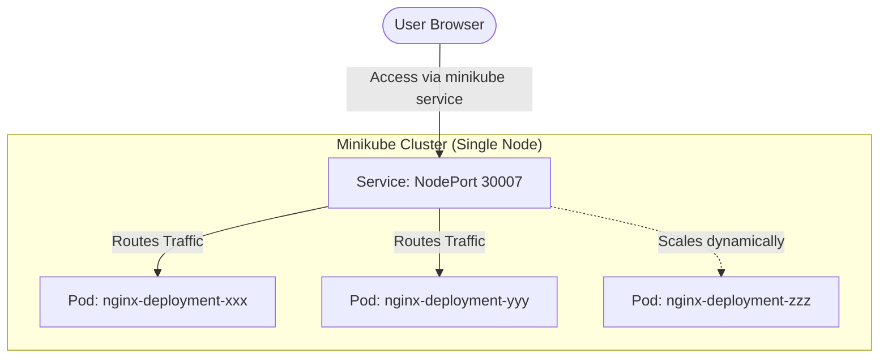

# Local Kubernetes Cluster Automation with Minikube

**Date:** February 19, 2026

**Topic:** Container Orchestration

**Project:** Local K8s Deployment, Scaling, and Management

## Project Overview

This project demonstrates the core concepts of **Container Orchestration** using Kubernetes (K8s). By utilizing `minikube` to simulate a single-node cluster on a local machine, this project successfully deploys a highly available NGINX web application, exposes it to the local network via a Service, and dynamically scales the infrastructure to handle increased load.

## 1. The 5 W's & How

* **What?** <br> A fully functional local Kubernetes cluster running a containerized web server. It uses declarative YAML files to define the desired state of the infrastructure.
* **Why?** <br> Docker alone cannot easily manage hundreds of containers across multiple servers. Kubernetes provides self-healing (restarting crashed apps), auto-scaling, and load balancing.
* **How?** <br> Using `minikube` to create the virtual cluster environment, Docker as the underlying container engine, and `kubectl` as the command-line client to interact with the Kubernetes API.
* **When?** <br> This setup is used during the local development and testing phase before pushing configurations to a production cloud environment (like AWS EKS or Azure AKS).
* **Where?** <br> The entire architecture runs locally on a Windows machine using Docker Desktop's engine.

## Tech Stack

| Component | Technology | Description |
| --- | --- | --- |
| **Orchestrator** | Kubernetes (K8s) | Manages container lifecycle and networking |
| **Local Environment** | Minikube | Provisions a single-node local cluster |
| **CLI Tool** | Kubectl | The command-line interface for the K8s API |
| **Container Engine** | Docker | The underlying runtime executing the pods |

## Project File Structure

```text
k8s-minikube-demo/
│
├── deployment.yaml          # Defines the Pods and ReplicaSet for NGINX
├── service.yaml             # Defines the network exposure (NodePort)
├── minikube.exe             # Local cluster provisioning binary
├── kubectl.exe              # Kubernetes API client binary
├── scaling_proof.png        # Screenshot demonstrating 5 running pods
└── README.md                # Project documentation

```

## 2. Architecture Diagram



## 3. End-to-End Execution Guide

### Phase 1: Setup & Initialization

To bypass Windows PATH variable configurations, the binaries are executed directly from the project directory.

1. **Download Binaries (PowerShell):**
```powershell
Invoke-WebRequest -OutFile minikube.exe -Uri https://github.com/kubernetes/minikube/releases/latest/download/minikube-windows-amd64.exe

Invoke-WebRequest -OutFile kubectl.exe -Uri https://dl.k8s.io/release/v1.29.0/bin/windows/amd64/kubectl.exe
```


2. **Start the Cluster:**
Ensure Docker Desktop is running, then provision the cluster.
```powershell
./minikube start --driver=docker
```


3. **Verify Node Status:**
```powershell
./kubectl get nodes
```


### Phase 2: Deployment

1. **Apply the Application Configuration:**
Instructs K8s to pull the NGINX image and ensure 2 replicas are running.
```powershell
./kubectl apply -f deployment.yaml
```


2. **Apply the Network Service:**
Exposes the deployment on port 30007.
```powershell
./kubectl apply -f service.yaml
```


3. **Verify Pod Creation:**
Wait until the status changes from `ContainerCreating` to `Running`.
```powershell
./kubectl get pods
```


### Phase 3: Access & Scaling

1. **Access the Application:**
Opens a network tunnel from the Minikube environment to the host machine's browser.
```powershell
./minikube service nginx-service
```


2. **Horizontal Scaling:**
Dynamically increase the replica count from 2 to 5 to handle simulated traffic.
```powershell
./kubectl scale deployment nginx-deployment --replicas=5
```


3. **Inspect Logs & Events:**
View the detailed lifecycle events of a specific pod for debugging.
```powershell
./kubectl describe pod <insert-pod-name>
```


### Phase 4: Teardown

1. **Stop the Cluster:**
Safely halts the virtual environment to free up system resources.
```powershell
./minikube stop
```


## 4. Troubleshooting Log (ERROR_LOG)

* **Error:** `open //./pipe/dockerDesktopLinuxEngine: The system cannot find the file specified.`
* **Cause:** Minikube attempted to provision the cluster, but the Docker Desktop engine was not actively running in the background.
* **Resolution:** Started Docker Desktop and waited for the "Engine running" indicator before executing `./minikube start`.


* **Error:** `couldn't get current server API group list`
* **Cause:** Executed a `kubectl` command while the Minikube cluster was offline. Kubectl had no API server to communicate with.
* **Resolution:** Ensured the cluster was successfully running via `minikube start` first.


* **Error:** Command not found in PowerShell.
* **Cause:** Binaries were not added to the system PATH.
* **Resolution:** Downloaded the `.exe` files directly to the working directory and executed them using the `./` prefix.


## 5. FAQ / Interview Prep

**1. What is Kubernetes?** <br>
Kubernetes (K8s) is an open-source container orchestration platform that automates the deployment, scaling, management, and networking of containerized applications.

**2. What is the role of the kubelet?** <br>
The `kubelet` is the primary "node agent" that runs on each worker node. It communicates with the master node's API server and ensures that the containers described in the PodSpecs are actually running and healthy on its specific node.

**3. Explain pods, deployments, and services.** <br>

* **Pod:** The smallest deployable computing unit in K8s. It encapsulates one or more containers that share network and storage resources.
* **Deployment:** A controller that provides declarative updates for Pods. It ensures the specified number of identical Pods (replicas) are running at all times and manages rollouts/rollbacks.
* **Service:** An abstraction that defines a logical set of Pods and a consistent policy to access them (a permanent IP/DNS), ensuring traffic reaches the application even as underlying Pods are destroyed and recreated.

**4. How do you scale in Kubernetes?** <br>
Scaling can be done manually using the CLI (`kubectl scale deployment <name> --replicas=<number>`) or automatically using a Horizontal Pod Autoscaler (HPA), which adds or removes Pods based on observed CPU or memory utilization.

**5. What is a namespace?** <br>
A namespace is a mechanism to isolate groups of resources within a single Kubernetes cluster. It acts as a virtual sub-cluster, commonly used to separate environments (e.g., `dev`, `staging`, `prod`) or different engineering teams.

**6. Difference between ClusterIP, NodePort, LoadBalancer?** <br>

* **ClusterIP (Default):** Exposes the service on a cluster-internal IP. It is only reachable from *inside* the cluster.
* **NodePort:** Exposes the service on each Node’s IP at a static port (between 30000-32767). It makes the service accessible from outside the cluster.
* **LoadBalancer:** Provisions an external cloud load balancer (e.g., AWS ALB) and assigns a public IP address to route traffic into the cluster.

**7. What are config maps?** <br>
ConfigMaps are API objects used to store non-confidential data in key-value pairs. They allow developers to decouple environment-specific configuration artifacts from container image content, keeping applications highly portable.

**8. How do you perform rolling updates?** <br>
Kubernetes Deployments handle rolling updates natively. When a Deployment's pod template is updated (e.g., changing the image to a new version), K8s incrementally creates new Pods and terminates old ones, ensuring the application remains available with zero downtime during the transition.
